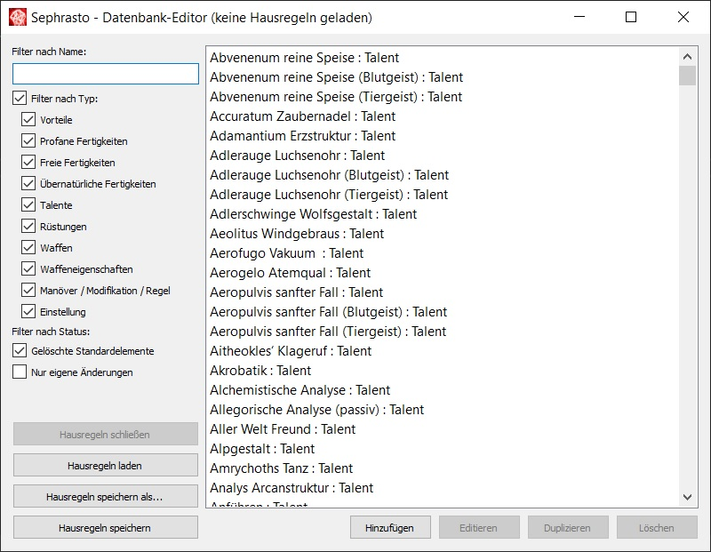
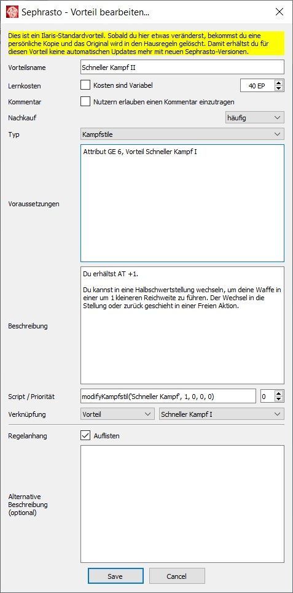

[Hilfe](Help.md) > Datenbankeditor

# Datenbank-Editor
Mit einem Klick auf **Regelbasis bearbeiten** , öffnet sich ein neues Fenster mit dem Regelbasis-Editor. Dieser Editor erlaubt es dir, Sephrasto individuell auf deine Gruppe zuzuschneiden. Über ihn kannst du die Regeln, welche sämtliche Talente, Vorteile, Fertigkeiten und Waffen definieren, nach Belieben ändern, neue hinzufügen und andere entfernen. Diese werden hier zusammenfassend Datenbank-Elemente genannt.
<br /><br />

<br /><br />
In der linken Hälfte kannst du durch Suche und/oder Filter auswählen, welche Regeln dir angezeigt werden. Die Liste in der rechten Hälfte, beinhaltet dann alle Regeln, die in diese Kategorien passen.
<br /><br />
Die Knöpfe in der unteren rechten Ecke erlauben es dir, neue Regeln zu erstellen, die ausgewählte Regel zu bearbeiten sowie Regeln zu duplizieren und zu löschen. Auch ein Doppelklick auf einen Listeneintrag bringt dich zum Bearbeitungsfenster. Du kannst auch mehrere Listeneinträge markieren um die entsprechende Aktion bei allen auf einmal anzuwenden.
<br /><br />
In der unteren linken Ecke schließlich kannst du die fertige Regelbasis speichern oder eine andere laden. Sephrasto verwendet als Basis immer die mitgelieferte _datenbank.xml_, die im gleichen Ordner wie die ausführbare Datei abgelegt ist. Alle Änderungen, die du vornimmst, werden in einer separaten Hausregel-Datenbank - ebenfalls eine XML-Datei - gespeichert. Wenn du sie lädst, wird sie über die Basis-Datenbank "drüber" geladen. Diese funktioniert wie folgt:
- Wann immer du einen Eintrag änderst, erhältst du eine Kopie aus der Basis-Datenbank und das Original wird als gelöscht markiert.
- Damit erhältst du für diese Hausregel-Datenbank keine Aktualisierungen mehr für dieses Datenbank-Element mit neuen Sephrastoversionen, z.B. falls der Steigerungsfaktor einer Fertigkeit durch Errata geändert wird. Falls du das Original wiederherstellst (s.u.) bist du wieder auf dem neuesten Stand.
- Geänderte oder hinzugefügte Datenbankelemente werden grün markiert, gelöschte rot. Wenn du also den Adlerschwinge änderst, siehst du einmal einen roten Eintrag (das Original aus der Basisdatenbank) und einen grünen Eintrag (die Kopie des Originals mit deinen Änderungen).
- Wenn du ein Original wiederherstellen möchtest, dann wähle es aus und klicke auf den Wiederherstellen-Knopf. Zuvor musst du aber eine eventuelle Hausregelkopie löschen.
<br />
## Einstellungsmöglichkeiten
Im folgenden werden einige der Einstellungsmöglichkeiten von Datenbank-Elementen erklärt. In Klammern stehen die Elemente, die diese Einstellungen anbieten. Das folgende Beispiel des Vorteils Schneller Kampf II zeigt die meisten beschriebenen Optionen.
<br /><br />

<br />
### Kosten sind Variabel (Vorteil, Talent)
Wenn diese Option aktiviert wird, können die Kosten für dieses Element im Charaktereditor händisch eingegeben werden. Die Kommentar-Option (s.u.) wird dann automatisch aktiviert.
<br />
### Nutzern erlauben einen Kommentar einzutragen (Vorteil, Talent)
Wenn diese Option aktiviert wird, erscheint im Charaktereditor ein Kommentarfeld, sobald das Element erworben wird. Das dort eingetragene wird im Charakterbogen in Klammern angefügt. Dies wird in erster Linie für Elemente verwendet, bei denen der Nutzer eine frei gewählte Angabe machen muss, wie z.B. beim Vorteil Besonderer Besitz.
<br />
### Voraussetzungen (Vorteil, Freie Fertigkeit, Übernatürliche Fertigkeit, Talent, Manöver/Modifikation/Regel)
In diesem Feld kannst du Voraussetzungen für die die Verfügbarkeit von Datenbank-Elementen festlegen. Der Vorteil Ausfall erfordert beispielsweise das Attribut Mut auf einem Wert von 4, bevor ein Charakter ihn erwerben kann steht. Folgende Voraussetzungen sind möglich:

- ```Attribut <KO, MU, GE, KK, IN, KL, CH, FF> <Mindestwert>```<br />
Überprüft, ob ein bestimmtes Attribut den angegebenen Mindestwert hat.<br />
Beispiel: Attribut MU 4

- ```MeisterAttribut <KO, MU, GE, KK, IN, KL, CH, FF> <Mindestwert>```<br />
Überprüft, ob ein bestimmtes den angegebenen Mindestwert hat und ob zwei beliebige weitere Attribute insgesamt einen Wert von mindestens 16 haben. Dies wird in erster Linie für Kampfstile und Traditionen der Stufe IV verwendet.<br />
Beispiel: MeisterAttribut KL 10

- ```Vorteil <Vorteilsname>```<br />
Überprüft, ob der Charakter den angegebenen Vorteil erworben hat.<br />
Beispiel: Vorteil Zauberer I

- ```Kein Vorteil <Vorteilsname>```<br />
Überprüft, ob der Charakter den angegebenen Vorteil nicht erworben hat.<br />
Beispiel: Kein Vorteil Zauberer I

- ```Fertigkeit '<Fertigkeitsname>' <Mindestwert>```<br />
Überprüft, ob der Charakter eine bestimmte Fertigkeit auf dem angegebenen Mindestwert hat. Ein Wert von -1 hat ein spezielle Bedeutung, hier wird an Stelle des Fertigkeitswerts überprüft, ob mindestens ein Talent aktiviert ist. Dies wird in erster Linie für das Datenbankelement Manöver/Modifikation/Regel verwendet.<br />
Beispiel: Fertigkeit 'Handwerk' 8

- ```Übernatürliche-Fertigkeit '<Fertigkeitsname>' <Mindestwert>```<br />
Überprüft, ob der Charakter eine bestimmte übernatürliche Fertigkeit auf dem angegebenen Mindestwert hat. Ein Wert von -1 hat ein spezielle Bedeutung, hier wird an Stelle des Fertigkeitswerts überprüft, ob mindestens ein Talent aktiviert ist. Dies wird in erster Linie für das Datenbankelement Manöver/Modifikation/Regel verwendet.<br />
Beispiel: Übernatürliche-Fertigkeit 'Antimagie' -1

- ```Talent <Talentname>```<br />
Überprüft, ob der Charakter das angegebene Talent erworben hat. Dies wird in erster Linie für das Datenbankelement Manöver/Modifikation/Regel verwendet.<br />
Beispiel: Talent Arcanovi Artefakt

- ```Waffeneigenschaft <Waffeneigenschaftsname>```<br />
Überprüft, ob der Charakter eine Waffe mit der angegebenen Waffeneigenschaft besitzt. Statt einer Waffeneigenschaft kann auch "Nahkampfwaffe" oder "Fernkampfwaffe" spezifiziert werden. Dies wird in erster Linie für das Datenbankelement Manöver/Modifikation/Regel verwendet.<br />
Beispiel: Waffeneigenschaft Stumpf.

Falls mehrere Voraussetzungen erfüllt sein müssen, können diese komma-separiert angegeben werden, z.B. wie beim Vorteil Gesegnete Waffe: Attribut MU 6, Vorteil Geweiht I.<br />
Falls nur eine von mehrere Voraussetzungen erfüllt sein muss, können die Voraussetzungen mit einem ODER verknüpft werden, z.B. wie beim Vorteil Reiterkampf I: Attribut GE 4 ODER Attribut KK 4.
<br />
### Alternative Beschreibung (Vorteil)
Die Beschreibung wird sowohl im Charaktereditor angezeigt, als auch im Regelanhang ausgegeben. Über das Feld alternative Beschreibung kann im Regelanhang ein anderer Text ausgegeben werden. In diesem Alternativtext gibt es außerdem die Möglichkeit über das Makro $kommentar$ den Inhalt des Kommentarfelds an gewünschter Stelle einzufügen (siehe Kampfstil/Tradition IV Vorteile).
<br />
### Regelanhang auflisten (Talent)
Wenn diese Option ausgeschaltet ist, wird das Talent nicht im Regelanhang aufgeführt. Dies wird in erster Linie für Mirakel verwendet, deren Regeln repetetiv sind und separat als Regel-Element im Regelanhang auftauchen.
<br />
### Script / Priorität (Vorteil, Waffeneigenschaft)
In diesem Feld kannst du Python-Skripte einfügen, die beim Erwerb des Elements ausgeführt werden. Hierfür steht dir Sephrastos [Script-API](ScriptAPI.md) zu Verfügung.
Wenn mehrere Skripte den gleichen Wert verändern, kann die Reihenfolge der Ausführung eine Rolle spielen. Über die Priorität kannst du diese Reihenfolge beeinflussen - je niedriger der Wert, desto früher wird das Skript ausgeführt.
<br />
### Verknüpfung (Vorteil)
Über diese Felder kann ein Vorteil mit einem Element vom Typ Vorteil, Übernatürliches Talent oder Manöver/Modifikation/Regel verknüpft werden. Dies bewirkt zwei Dinge:
1. Verknüpfte Vorteile werden im Charakterbogen zusammengefasst. Falls ein Charakter z.B. Schneller Kampf I-III erworben hat, so wird dies durch die Verknüpfung genau so in ein Feld des Charakterbogens eingetragen und nicht als drei einzelne Vorteile in separate Felder.
2. Verknüpfte Elemente werden im Regelanhang zusammengeführt, damit der Anhang einerseits kompakter wird und andererseits die Regeln im passenden Kontext beieinander stehen. Beispiel: Der Vorteil Schnelle Heilung ist mit der Regel Regeneration verknüpft - dies bewirkt, dass die Regeln zu Schnelle Heilung direkt bei den Regenerationsregeln aufgeführt werden, statt als eigener Absatz unter Vorteile.
<br />
## Besondere Datenbank-Elemente
Die folgenden Elemente können nicht im Charaktereditor gesehen werden:
- Manöver/Modifikation/Regel: Hier können allgemeine Regeln eingetragen werden. Diese werden ausschließlich im Regelanhang verwendet.
- Einstellung: Einstellungen definieren die verfügbaren Typen von Vorteilen usw. oder modifizieren das Verhalten von Sephrasto, so können z.B. die EP-Kosten von Freien Fertigkeiten geändert werden. Es können keine eigenen Einstellungen hinzugefügt werden. Wenn eine geänderte Einstellung gelöscht wird, so wird das Original automatisch wiederhergestellt.
<br />
## Sonderfälle
Der Datenbankeditor ist sehr vielseitig, aber es gibt ein paar Sonderfälle, diese werden hier erläutert:
- Um (nicht erlaubte) Namensdopplungen bei Talenten zu vermeiden, können diese einen beliebigen Text (üblicherweise den Fertigkeitsnamen), gefolgt von einem Doppelpunkt vor ihrem Namen aufweisen, dies wird in der Anzeige und im Charakterbogen gekürzt. Dies ist beispielsweise bei den Gebräuche- und Überleben-Talenten der Fall, z.B. "Gebräuche: Mittelreich".
- Die Heimatgebiet-Liste des Charaktereditors wird durch alle Talente befüllt, deren Name mit "Gebräuche: " beginnt. Die Fertigkeit Gebräuche kann aber ohne Probleme gelöscht werden.
- Rüstungen können separat fürs Zonensystem und das einfache Rüstungssystem angelegt werden. Um Namensdopplungen zu vermeiden können die Varianten fürs ZRS mit " (ZRS)" enden, dies wird in der Anzeige und im Charakterbogen gekürzt.
- Um tiefergreifende Anpassungen an Sephrasto vorzunehmen ist eventuell ein selbst geschriebenes [Plugin](PluginAPI.md) notwendig. Beispielsweise kann hiermit die EP-Kostenberechnung aller Datenbankelemente oder der gesamte PDF-Output angepasst werden.