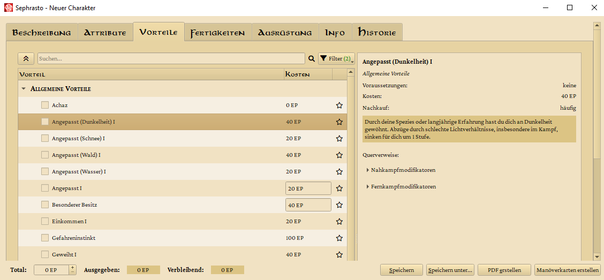

# Sephrasto
Ein Charaktergenerator für das DSA-Hausregelsystem Ilaris, erstellt von Aeolitus. So vollständig wie möglich. Eine Gebrauchsanweisung findest du, wenn du im Hauptfenster auf den Hilfe-Button clickst.



## Features
* ⚡ **Schnell**: Dank Archetypen kann ein Charakter binnen Minuten erstellt werden
* 📜 **Komfortabel**: Relevante Regeln werden angezeigt und können der PDF angehängt werden.
* ⚖️ **Flexibel**: Die Regelbasis (Fertigkeiten, Vorteile etc.) kann frei editiert und erweitert werden
* 🧩 **Erweiterbar**: Tierbegleiter, VTT-Exports, Manöverkarten und vieles mehr steht durch plugins bereit
* ♻️ **Reversibel**: Steigerungen können rückgängig gemacht werden
* 🤝 **Freundlich**: Von und für die Ilaris-Community entwickelt. Fragen und Vorschläge sind immer wilkommen: [DSA-Forum](https://dsaforum.de/viewtopic.php?t=45794&sid=f6d460e9749e5943fbd2c06b439bd46a) | [Discord](https://discord.gg/RsRcspq254)

## Verwendete Pakete und Programme
* Um Sephrasto mit [Python](https://www.python.org) zu verwenden, wird Version 3.11 empfohlen. Höhere Versionen sollten auch gehen, die Mindestversion ist 3.9.
* [PySide6](https://www.qt.io/qt-for-python) für die Grafische Oberfläche
* [lxml](http://lxml.de/) als xml-parser
* [PyYAML](https://pyyaml.org/) als yaml-parser
* [RestrictedPython](https://github.com/zopefoundation/RestrictedPython) zum Absichern der durch Benutzer erstellbaren Python Scripts
* [cx_freeze](https://github.com/marcelotduarte/cx_Freeze) (optional) um Sephrasto-Builds zu erstellen
* [mkdocs](https://github.com/mkdocs/) und mkdocs-material (optional). Zum Konvertieren der Markdown-Dokumentation in HTML.

Mitgeliefert werden außerdem:
* [fdfgen](https://github.com/ccnmtl/fdfgen) zum Editieren des Charakterbogens
* [cpdf](https://www.coherentpdf.com) zur Reduzierung der Dateigröße des Charakterbogens
* [hyphen](https://github.com/ytiurin/hyphen) für das korrekte Umbrechen von Textzeilen im Regelanhang

Die zugehörigen Lizenzen können hier gefunden werden: [Acknowledgements](docs/acknowledgements.md)

## Installation Linux

Auto:
```bash
curl -sSL https://github.com/Aeolitus/Sephrasto/raw/master/tools/install_linux.sh | bash
```

Manual:

```
sudo apt install python3-pip
sudo apt install openjdk-11-jdk
sudo apt install pdftk
git clone https://github.com/Aeolitus/Sephrasto.git
pip install -r Sephrasto/requirements.txt
```
OpenJDK wird für pdftk benötigt, ohne diese beiden Pakete können keine Charakterbogen-PDFs erzeugt werden. Statt das Sephrasto Repository mit git zu klonen, kannst du es natürlich auch manuell herunterladen und entpacken (unter "Code" den Punkt "Download zip" auswählen).

Gestartet wird Sephrasto dann folgendermaßen:
```
python Sephrasto/src/Sephrasto/Sephrasto.py
```

Versuche es folgendermaßen, falls das nicht klappt:
```
python3 Sephrasto/src/Sephrasto/Sephrasto.py
```

Alternativ gibt es hier aus der Community einen Installer für Void Linux, Ubuntu/Debian und Arch Linux (ohne Gewähr): https://github.com/kgitthoene/multi-linux-sephrasto-installer

### Sephrasto Userordner ###
Wenn dich der automatisch generierte Sephrasto-Ordner im Userverzeichnis stört, kannst du ihn von "sephrasto" in ".sephrasto" umbenennen, um ihn zu verstecken. Sephrasto wird dann den "sephrasto" Ordner nicht neu erstellen.

## Installation Windows
Für Windows stellen wir unter https://github.com/Aeolitus/Sephrasto/releases builds zur Verfügung.

## Installation macOS
* Lade den neuesten Sephrasto Sourcecode herunter (https://github.com/Aeolitus/Sephrasto/releases) und entpacke ihn an einen Ort deiner Wahl. 
* Installiere Python 3.11: https://www.python.org/downloads/macos/
* Control-Click auf den Sephrasto-Ordner und wähle "New Terminal at Folder"
* Tippe im Terminal: ```python3 -m ensurepip```
* ... gefolgt von: ```python3 -m pip install -r requirements.txt```
* Installiere pdftk von folgendem Link: https://www.pdflabs.com/tools/pdftk-the-pdf-toolkit/pdftk_server-2.02-mac_osx-10.11-setup.pkg
 WICHTIG: Nutze bitte den genannten Link. Der Download-Button auf der Webseite führt zu einer alten Version, die nicht mehr funktioniert (Stand 08/22).
* Wechsle im Sephrasto-Ordner in src/Sephrasto
* Control-Click auf Sephrasto.py -> Get Info -> Open with -> "Python Launcher" auswählen.

Gestartet wird Sephrasto dann folgendermaßen:
* Doppelclick auf Sephrasto.py (natürlich kannst du auch ein Alias erstellen)
* Beim ersten Start musst du über System Preferences -> Security & Privacy noch die Ausführung erlauben. Beim ersten PDF-Export das gleiche für cpdf.
* Optional kannst du im Python Launcher noch "Run in a Terminal window" deaktivieren, um das zusätzliche Terminalfenster loszuwerden

## Kommandozeilenargumente
|Argument|Parameter|Beschreibung|
|---|---|---|
|\-\-settingsfile|"pfad/zu/Sephrasto.ini"|Überschreibt den Pfad der Sephrasto.ini welche die Einstellungen enthält.|
|\-\-noplugins|kein Parameter|Weist Sephrasto an, keine Plugins zu laden - unabhängig von den Einstellungen.|
|\-\-debug|kein Parameter|Lognachrichten werden auch in der Konsole ausgegeben und weitere Debugfeatures werden aktiviert.|
|\-\-loglevel|0, 1 oder 2|Setzt das Loglevel (0 = error, 1 = warning, 2 = debug). Dies überschreibt das in den Einstellungen konfigurierte Loglevel.|
|\-\-migrate|"pfad/zu/charakter.xml"|Lädt und speichert den angegeben Charakter. Dies kann genutzt werden, um ohne UI-Interaktion Migrationen zu applizieren, z. B. für Charakterassistent-Dateien.|
|\-\-prerelease\-plugins|kein Parameter|Weist den Pluginmanager an, die neuesten Prerelease-Plugins herunterzuladen, falls verfügbar.|

## Für Entwickler

### Erstellen von Windows builds
Stelle sicher, dass alle Pakete aus der requirements.txt installiert sind. Aktuell nutzen wir außerdem Python 3.11 und cx_Freeze 7.0.0 zum Erstellen von Windows builds. Nun solltest du build.bat im Sephrasto root ausführen können.

### Einrichtung von Visual Studio als IDE
* Installiere VS Community Edition mit dem Python Workload (kann auch nachträglich über den Installer installiert werden)
* Setze den Pfad der Python-Umgebung in der Umgebungsvariable PATH (in der Regel C:\Program Files (x86)\Microsoft Visual Studio\Shared\Python37_64)
* Erstelle ein virtual environment
    * Navigiere auf der Kommandozeile in den Sephrasto repository root
    * venv erstellen: ```python -m venv venv```
	* venv aktivieren: ```venv\Scripts\activate```
	* pip upgraden: ```python -m pip install --upgrade pip```
	* Von Sephrasto benötigte Pakete installieren: ```pip install -r requirements.txt```
* Öffne Sephrasto/src/Sephrasto.sln
* Erstelle die IntelliSense Datenbank: Solution Explorer -> Rechtsclick auf Python Environments -> View all Python environments -> IntelliSense im Dropdown auswahlen und aktivieren/refreshen
* Stelle das Tab-Verhalten auf "Insert Spaces": Tools -> Options -> Text Editor -> Python -> Tabs
* Öffne das Exception Settings Fenster (Debug -> Windows -> Exception Settings) und selektiere alle Python Exceptions, dann deaktiviere <All Python Exceptions not in this list>, BaseException und Exception - damit breaken die custom exceptions nicht, die Sephrasto intern nutzt.

### UI design mit Qt
* Modifiziere niemals Dateien im "src/Sephrasto/UI" Ordner von Hand!
* Stattdessen wird das UI durch ".ui"-XML-Dateien im "designer" Ordner definiert. Optionalerweise können diese mit dem Qt Creator visuell designed werden (enthalten im Qt-Installer unter https://www.qt.io/).
* Aus diesen Dateien wird dann der Python-Code mit Hilfe von "designer/convert.bat" erzeugt.
* Bei Problemen mit convert.bat, stelle sicher, dass:
    * ... der Python Install-Ordner und der Unterordner "Scripts" in deiner PATH-Umgebungsvariable enthalten sind. Dies wird normalerweise vom Python installer automatisch gemacht. (Windows 10: System -> Advanced System Settings -> Environment Variables -> Path - in User oder System)
    * ... "Python/Scripts" die Datei "pyside6-uic.exe" enthält. Diese wird normalerweise durch das Installieren von PySide6 dort angelegt.

### Update der Dokumentation
Die Markdown-Dokumente in /docs werden für Sephrastos-In-App-Hilfe in HTML konvertiert. Dies muss also nach jeder Änderung der Dokumente durchgeführt werden.

Installation:
* Installiere mkdocs: ```pip install mkdocs```
* Installiere mkdocs-material: ```pip install mkdocs-material```

Update der HTML-Dateien:
* Navigiere auf der Kommandozeile in den Serphasto-Repo-Root.
* Führe aus: ```mkdocs build```

### Plugin Repositories
Sephrasto unterstützt Plugin repositories, um als User die Plugins bequem aus den Einstellungen heraus verwalten zu können. In den Standardeinstellungen ist https://github.com/brzGatsu/SephrastoPlugins voreingetragen und wir empfehlen dir dort für deine Plugins einen PR zu erstellen. Du kannst aber auch ein eigenes Repository anlegen. Aktuell ist Sephrasto hier auf Github beschränkt und du musst folgender Konvention folgen:
* Der Sephrasto Pluginmanager benötigt eine Github API URL zu deiner /releases page. Beispiel: https://api.github.com/repos/brzGatsu/SephrastoPlugins/releases
* Du musst den oder die Pluginordner zippen (.zip) und bei Github als Release hochladen (nur diese eine Datei). Der Release muss als Git-Tag die Sephrasto-Target-Version im folgenden Format enthalten: "v4.4.0.0". Die vierte Zahl kannst du für Plugin-Updates innerhalb derselben Sephrastoversion verwenden. Sephrasto-Versionen die älter als das Target sind wird das Plugin(-Update) nicht angezeigt.
* Es gibt im Einstellungsdialog keine Option für weitere Repos, aber du kannst es händisch in der Sephrasto.ini eintragen unter "Plugin-Repos".

## Abschlussbemerkung
Der Code ist teilweise von furchtbarem Denglisch durchzogen, da Sephrasto ein ausschließlich deutsches Regelwerk umsetzt. Die Begrifflichkeiten in zu übersetzen wäre aber wenig hilfreich für die Lesbarkeit.