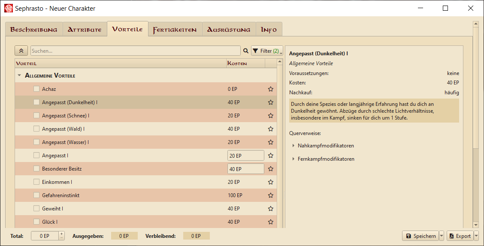

# Sephrasto
Der Charaktergenerator für [Ilaris](https://www.f-shop.de/das-schwarze-auge/partnerprodukte/buecher-cds/3803/ilaris-das-alternative-regelwerk-fuer-dsa), das alternative Regelwerk für Aventurien. Entwickelt von Aeolitus und Gatsu. So vollständig wie möglich. Eine Gebrauchsanweisung findest du, wenn du im Hauptfenster auf den Hilfe-Button klickst.



## Features
* ⚡ Blitzschnelle Charaktererstellung dank Archetypen
* 📜 Relevante Regeln direkt im Editor und Charakteranhang
* ⚖️ Hausregeln könne nahtlos eingefügt werden
* 🧩 Tierbegleiter, VTT-Exports, Manöverkarten und vieles mehr steht durch [Plugins](https://github.com/brzGatsu/SephrastoPlugins) bereit
* ♻️ Steigerungen können rückgängig gemacht werden
* 🤝 Von und für die Ilaris-Community entwickelt. Fragen und Vorschläge sind immer wilkommen: [DSA-Forum](https://dsaforum.de/viewtopic.php?t=45794&sid=f6d460e9749e5943fbd2c06b439bd46a) | [Discord](https://discord.gg/RsRcspq254)

## Installation

### Windows
Für Windows stellen wir unter https://github.com/Aeolitus/Sephrasto/releases Builds zur Verfügung.

Bitte installiere außerdem PDTtk Server. Sephrasto benötigt das Programm für den PDF Export: https://www.pdflabs.com/tools/pdftk-the-pdf-toolkit/pdftk_server-2.02-win-setup.exe

### Linux
Für Ubuntu und ähnliche Distributionen kannst du den automatischen Installer benutzen, indem du diesen Befehl in deinem Terminal ausführst:
```bash
wget -qO https://raw.githubusercontent.com/Aeolitus/Sephrasto/master/tools/install_linux.sh | bash -i
```
Der Installer erstellt einen Sephrasto Ordner dort, wo er ausgeführt wird, lädt alle Dateien und Pakete die benötigt werden automatisch herunter und erstellt einen Eintrag in deinem Startmenü.
Zum späteren Updaten kannst du den Ordner löschen und den Befehl erneut ausführen. Helden, Regeln und Plugins werden standardmäßig in einem anderen Ordner abgelegt.

Alternativ gibt es hier aus der Community einen Installer für Void Linux, Ubuntu/Debian und Arch Linux (ohne Gewähr): https://github.com/kgitthoene/multi-linux-sephrasto-installer

#### Manuelle Installation
Du kannst die aktuellste Entwicklerversion von Sephrasto auch in wenigen Schritten manuell herunterladen und starten.
Die folgenden Befehle installieren Python, PDFtk für den Charakterbogen-Export (inklusive das dafür benötigte OpenJDK) und die für Qt benötigte Cursor Lib. 
Danach wird das Sephrasto Repository mit git heruntergeladen - alternativ kannst du es natürlich auch manuell herunterladen und entpacken (unter "Code" den Punkt "Download zip" auswählen). 
Als nächstes wird in Python ein Virtual Environment für Sephrasto erstellt. Der letzte Befehl installiert alle benötigten Python-Pakete.

```
cd ziel/pfad/für/sephrasto
sudo apt install python3-pip openjdk-11-jdk pdftk libxcb-cursor0
git clone https://github.com/Aeolitus/Sephrasto.git
mkdir -p ~/.venvs
python3 -m venv ~/.venvs/sephrasto
source ~/.venvs/sephrasto/bin/activate
pip install -r Sephrasto/requirements.txt
```

Gestartet wird Sephrasto dann folgendermaßen:
```
source ~/.venvs/sephrasto/bin/activate
python3 Sephrasto/src/Sephrasto/Sephrasto.py
```

#### Sephrasto Userordner
Wenn dich der automatisch generierte Sephrasto-Ordner im Userverzeichnis stört, kannst du ihn von "sephrasto" in ".sephrasto" umbenennen, um ihn zu verstecken. Sephrasto wird dann den "sephrasto" Ordner nicht neu erstellen.

### MacOS
* Lade den neuesten Sephrasto Sourcecode herunter (https://github.com/Aeolitus/Sephrasto/releases) und entpacke ihn an einen Ort deiner Wahl. 
* Installiere Python 3.11.9: https://www.python.org/downloads/macos/
* Control-Click auf den Sephrasto-Ordner und wähle "Services -> New Terminal at Folder"
* Tippe im Terminal die folgenden drei Befehle, bestätige jeweils mit Enter:
    - ```python3 -m ensurepip```
    - ```python3 -m pip install --upgrade pip```
    - ```python3 -m pip install -r requirements.txt```
* Installiere pdftk von folgendem Link: https://www.pdflabs.com/tools/pdftk-the-pdf-toolkit/pdftk_server-2.02-mac_osx-10.11-setup.pkg
    - WICHTIG: Nutze bitte den genannten Link. Der Download-Button auf der Webseite führt zu einer alten Version, die nicht mehr funktioniert (Stand 08/22).
    - Die Installation wird zunächst blockiert. Du musst über "System Preferences -> Security & Privacy" die Ausführung erlauben

Gestartet wird Sephrasto dann folgendermaßen:
* Navigiere zu Sephrasto/tools/macOS und doppelclicke auf Sephrasto
* Beim ersten PDF-Export musst du wieder über "System Preferences -> Security & Privacy" die Ausführung von PDFtk erlauben, das gleiche für cpdf.
* Optional kannst du einen Alias für die obige Sephrasto-Datei erstellen. Dabei geht eventuell das Icon verloren - über Get Info kannst du das Icon kopieren und beim Alias einfügen.

## Kommandozeilenargumente
|Argument|Parameter|Beschreibung|
|---|---|---|
|\-\-settingsfile|"pfad/zu/Sephrasto.ini"|Überschreibt den Pfad der Sephrasto.ini welche die Einstellungen enthält.|
|\-\-noplugins|kein Parameter|Weist Sephrasto an, keine Plugins zu laden - unabhängig von den Einstellungen.|
|\-\-debug|kein Parameter|Lognachrichten werden auch in der Konsole ausgegeben und weitere Debugfeatures werden aktiviert.|
|\-\-loglevel|0, 1 oder 2|Setzt das Loglevel (0 = error, 1 = warning, 2 = debug). Dies überschreibt das in den Einstellungen konfigurierte Loglevel.|
|\-\-migrate|"pfad/zu/charakter.xml"|Lädt und speichert den angegeben Charakter. Dies kann genutzt werden, um ohne UI-Interaktion Migrationen zu applizieren, z. B. für Charakterassistent-Dateien.|
|\-\-prerelease\-plugins|kein Parameter|Weist den Pluginmanager an, die neuesten Prerelease-Plugins herunterzuladen, falls verfügbar.|

## Verwendete Pakete und Programme
* Um Sephrasto mit [Python](https://www.python.org) zu verwenden, wird Version 3.11 empfohlen. Höhere Versionen sollten auch gehen, die Mindestversion ist 3.9.
* [PySide6](https://www.qt.io/qt-for-python) für die Grafische Oberfläche
* [lxml](http://lxml.de/) als xml-parser
* [PyYAML](https://pyyaml.org/) als yaml-parser
* [RestrictedPython](https://github.com/zopefoundation/RestrictedPython) zum Absichern der durch Benutzer erstellbaren Python Scripts
* [cx_freeze](https://github.com/marcelotduarte/cx_Freeze) (optional) um Sephrasto-Builds zu erstellen
* [mkdocs](https://github.com/mkdocs/) und mkdocs-material (optional). Zum Konvertieren der Markdown-Dokumentation in HTML.

Mitgeliefert werden außerdem:
* [fdfgen](https://github.com/ccnmtl/fdfgen) zum Editieren des Charakterbogens
* [cpdf](https://www.coherentpdf.com) zur Reduzierung der Dateigröße des Charakterbogens
* [hyphen](https://github.com/ytiurin/hyphen) für das korrekte Umbrechen von Textzeilen im Regelanhang

Die zugehörigen Lizenzen können hier gefunden werden: [Acknowledgements](docs/acknowledgements.md)

## Mitmachen
Falls du Fragen oder Anregungen hast, schreib uns gerne:

[DSA-Forum](https://dsaforum.de/viewtopic.php?t=45794&sid=f6d460e9749e5943fbd2c06b439bd46a) | [Discord](https://discord.gg/RsRcspq254) | [GitHub Issue](https://github.com/Aeolitus/Sephrasto/issues/new)

Wenn du für dich oder für die Allgemeinheit an Sephrasto mitarbeiten willst oder ein eigenes Plugin schreiben möchtest lohnt sich ein Blick in die [CONTRIBUTING.md](CONTRIBUTING.md).
