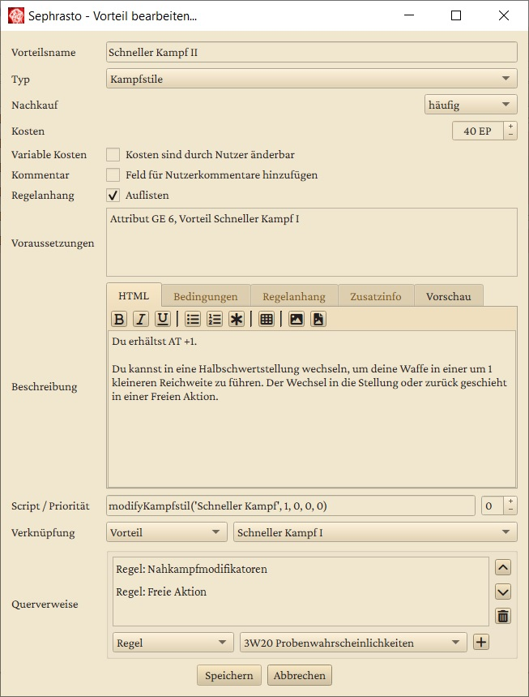

# Datenbank-Editor
Mit einem Klick auf **Regelbasis bearbeiten** , öffnet sich ein neues Fenster mit dem Regelbasis-Editor. Dieser Editor erlaubt es dir, Sephrasto individuell auf deine Gruppe zuzuschneiden. Über ihn kannst du die Regeln für Talente, Vorteile, Fertigkeiten Waffen usw. definieren, nach Belieben ändern, neue hinzufügen und andere entfernen. Diese werden hier zusammenfassend Datenbank-Elemente genannt.


In der linken Hälfte kannst du den Element-Typ auswählen, den du bearbeiten möchtest. Die Liste in der rechten Hälfte, beinhaltet dann alle existierenden und gelöschten Elemente dieses Typs. Standardmäßig haben alle Elemente ein Buch-Icon - dieses steht dafür, dass die Elemente den RAW (rules as written) entsprechen und unerändert sind.

In der Suchleiste kannst du nach Elementen suchen, die dein Suchwort (irgendwo) im Namen haben. Groß- und Kleinschreibung spielt hier keine Rolle. Dabei kannst du auch Wildcards verwenden (siehe Tooltip des Lupen-Icons oder <a href="https://docs.python.org/3/library/fnmatch.html">https://docs.python.org/3/library/fnmatch.html</a>). Wenn du einen Haken bei "Volltext" setzt, wird auch die Beschreibung der Elemente nach dem Suchwort durchforstet.

Mit einem Klick auf "Datei" in der Menuleiste kannst du deine Hausregeln speichern oder andere laden. Sephrasto verwendet als Basis immer die mitgelieferte _datenbank.xml_, die im gleichen Ordner wie die _Sephrasto.exe_ abgelegt ist. Alle Änderungen, die du vornimmst, werden in einer separaten Hausregel-Datenbank - ebenfalls eine XML-Datei - gespeichert. Wenn du sie lädst, wird sie über die Basis-Datenbank "drüber" geladen. Diesen Vorgang kannst du mit "Zusätzlich öffnen" wiederholen und so die Daten aus mehreren Hausregel-Datenbanken kombinieren.

Die Buttons in der unteren rechten Ecke erlauben es dir, neue Regeln zu erstellen, die ausgewählte Regel zu bearbeiten sowie Regeln zu duplizieren und zu löschen. Auch ein Doppelklick auf einen Listeneintrag bringt dich zum Bearbeitungsfenster. Du kannst auch mehrere Listeneinträge markieren um die entsprechende Aktion bei allen auf einmal anzuwenden.

- Wann immer du ein Element änderst, erhält es ein blaues Bearbeitet-Icon. Damit erhältst du für diese Hausregel-Datenbank keine Aktualisierungen mehr für dieses Datenbank-Element mit neuen Sephrastoversionen, z.B. falls der Steigerungsfaktor einer Fertigkeit durch Errata geändert wird. Wenn du bearbeitete Elemente auswählst, erscheint unten rechts ein Button mit Buch-Icon mit dem du die originalen RAW Daten ansehen kannst. Wenn du sie löschst, wirst du gefragt, ob das Element komplett gelöscht werden soll oder ob du die RAW-Daten wiederherstellen möchtest.
- Komplett neu hinzugefügte Datenbankelemente werden mit einem grünen Plus-Icon markiert.
- Aus der Basisdatenbank gelöschte Elemente werden mit einem roten Minus-Icon markiert. Wenn du sie wiederherstellen möchtest, dann wähle sie aus und klicke auf den Wiederherstellen-Button.

## Einstellungsmöglichkeiten
Im folgenden werden einige der Einstellungsmöglichkeiten von Datenbank-Elementen erklärt. In Klammern stehen die Elemente, die diese Einstellungen anbieten. Das folgende Beispiel des Vorteils Schneller Kampf II zeigt die meisten beschriebenen Optionen.



### Variable Kosten (Vorteil, Talent)
Wenn diese Option aktiviert wird, können die Kosten für dieses Element im Charaktereditor händisch eingegeben werden. Die Kommentar-Option (s.u.) wird dann automatisch aktiviert.

### Kommentar (Vorteil, Talent)
Wenn diese Option aktiviert wird, erscheint im Charaktereditor ein Kommentarfeld, sobald das Element erworben wird. Das dort eingetragene wird im Charakterbogen in Klammern angefügt. Dies wird in erster Linie für Elemente verwendet, bei denen der Nutzer eine frei gewählte Angabe machen muss, wie z.B. beim Vorteil Besonderer Besitz.

### Voraussetzungen (Energie, Vorteil, Freie Fertigkeit, Übernatürliche Fertigkeit, Talent, Regel)
In diesem Feld kannst du Voraussetzungen für die die Verfügbarkeit von Datenbank-Elementen festlegen. Der Vorteil Ausfall erfordert beispielsweise das Attribut Mut auf einem Wert von 4, bevor ein Charakter ihn erwerben kann. Folgende Voraussetzungen sind möglich:

- ```Attribut <KO, MU, GE, KK, IN, KL, CH, FF> <Mindestwert>```<br>
Überprüft, ob ein bestimmtes Attribut den angegebenen Mindestwert hat.<br>
Beispiel: Attribut MU 4

- ```MeisterAttribut <KO, MU, GE, KK, IN, KL, CH, FF> <Mindestwert>```<br>
Überprüft, ob ein bestimmtes Attribut den angegebenen Mindestwert hat und ob zwei beliebige weitere Attribute insgesamt einen Wert von mindestens Wert \* 1.6 haben. Dies wird in erster Linie für Kampfstile und Traditionen der Stufe IV verwendet.<br>
Beispiel: MeisterAttribut KL 10

- ```Vorteil <Vorteilsname>```<br>
Überprüft, ob der Charakter den angegebenen Vorteil erworben hat. Im Namen können auch Wildcards verwendet werden (<a href="https://docs.python.org/3/library/fnmatch.html">https://docs.python.org/3/library/fnmatch.html</a>) - das Element selbst wird hierbei ausgenommen.<br>
Beispiel: Vorteil Zauberer I, Vorteil Tradition der *geweihten I

- ```Kein Vorteil <Vorteilsname>```<br>
Überprüft, ob der Charakter den angegebenen Vorteil nicht erworben hat. Im Namen können auch Wildcards verwendet werden (<a href="https://docs.python.org/3/library/fnmatch.html">https://docs.python.org/3/library/fnmatch.html</a>) - das Element selbst wird hierbei ausgenommen.<br>
Beispiel: Kein Vorteil Zauberer I, Kein Vorteil Tradition der *geweihten I

- ```Fertigkeit '<Fertigkeitsname>' <Optional: Mindest-PW(T)>```<br>
Überprüft, ob der Charakter eine bestimmte Fertigkeit auf dem angegebenen Mindest-PW(T) hat. Wenn du keinen Mindestwert oder -1 angibst, wird an Stelle des Fertigkeitswerts überprüft, ob mindestens ein Talent aktiviert ist. Dies wird in erster Linie für das Datenbankelement Regel verwendet.<br>
Beispiel: Fertigkeit 'Handwerk' 8

- ```Übernatürliche-Fertigkeit '<Fertigkeitsname>' <Optional: Mindest-PW(T)>```<br>
Überprüft, ob der Charakter eine bestimmte übernatürliche Fertigkeit auf dem angegebenen Mindest-PW(T) hat. Wenn du keinen Mindestwert oder -1 angibst, wird an Stelle des Fertigkeitswerts überprüft, ob mindestens ein Talent aktiviert ist. Dies wird in erster Linie für das Datenbankelement Regel verwendet.<br>
Beispiel: Übernatürliche-Fertigkeit 'Antimagie'

- ```Talent '<Talentname>' <Optional: Mindest-PW(T)>```<br>
Profane Talente: Überprüft, ob eine der Talent-Fertigkeiten den angegebenen Mindest-PW oder Mindest-PW(T) hat, je nachdem, ob das Talent erworben wurde. Wenn du keinen Mindestwert oder -1 angibst, wird nur überprüft, ob das Talent erworben wurde.<br>
Übernatürliche Talente: Überprüft, ob das Talent erworben wurde und eine der Talent-Fertigkeiten den angegebenen Mindest-PW(T) hat. Wenn du keinen Mindestwert oder -1 angibst, wird nur überprüft, ob das Talent erworben wurde.<br>
Dies wird in erster Linie für das Datenbankelement Regel verwendet.<br>
Beispiel: Talent 'Arcanovi Artefakt' 10

- ```Waffeneigenschaft <Waffeneigenschaftsname>```<br>
Überprüft, ob der Charakter eine Waffe mit der angegebenen Waffeneigenschaft besitzt. Statt einer Waffeneigenschaft kann auch "Nahkampfwaffe" oder "Fernkampfwaffe" spezifiziert werden. Dies wird in erster Linie für das Datenbankelement Regel verwendet.<br>
Beispiel: Waffeneigenschaft Stumpf

- ```Spezies <Speziesname>```<br>
Überprüft, ob der Charakter der angegebenen Spezies angehört.<br>
Beispiel: Spezies Mensch

Falls mehrere Voraussetzungen erfüllt sein müssen, können diese komma-separiert angegeben werden, z.B. wie beim Vorteil Gesegnete Waffe: Attribut MU 6, Vorteil Geweiht I.
Falls nur eine von mehrere Voraussetzungen erfüllt sein muss, können die Voraussetzungen mit einem ODER verknüpft werden, z.B. wie beim Vorteil Reiterkampf I: Attribut GE 4 ODER Attribut KK 4.

### Beschreibung (fast alle)
Die Beschreibung wird sowohl im Charaktereditor angezeigt, als auch im Regelanhang ausgegeben. Hierbei kannst du HTML verwenden, wobei für die meisten Tags (table, ul, etc.) von Sephrasto automatisch ein CSS-Stylesheet appliziert wird. Über die Toolbar hast du außerdem zwei Möglichkeiten, Bilder einzufügen:

- Als Link zu einer Bilddatei auf deiner Festplatte. Du kannst hier entweder einen absoluten Pfad angeben, oder eines der Makros **$sephrasto_dir$**, **$regeln_dir$** oder **$plugins_dir$** verwenden, um einen relativen Pfad zum Sephrasto-Installations-/Hausregel- oder Plugins-Ordner anzugeben. Beispiel: ``````
- Eingebettet als Text. Das Bild wird in Text konvertiert und direkt in die Beschreibung eingefügt. Der Inhalt der Beschreibung wird dadurch ziemlich lang und die Größe deiner Hausregeldatei wächst. Dafür kann das Bild im Gegensatz zu einem Link nicht verloren gehen. Das Bild wird dabei auf maximal 512x512 Pixel reduziert.
  
Bei Vorteilen und Talenten kannst du außerdem eine **Zusatzinfo** angeben, die im Charaktereditor nach der eigentlichen Beschreibung angezeigt wird. Dies kann Beispielsweise eine Erklärung sein, was der Nutzer in das Kommentarfeld eintragen soll.

Ausschließlich bei Vorteilen kannst du zudem noch eine alternative Beschreibung für den **Regelanhang** angeben. Hier kannst du außerdem das Makro **$kommentar$** verwenden, um Sephrasto den Nutzerkommentar an entsprechender Stelle einfügen zu lassen (falls die Option aktiviert ist). Ebenso hast du bei Vorteilen noch die Möglichkeit **Bedingungen** für die Nutzung des Vorteils anzugeben, beispielsweise benötigte Waffen bei einem Kampfstil oder erforderliche Gesten usw. bei Zaubertraditionen.

Ausschließlich bei Talenten kannst du das Makro **$talent:Talentname** verwenden, um die Beschreibung eines anderen Talents einzufügen. Dabei werden Angaben zu Fertigkeiten und Erlernen herausgestrichen, da diese sich fast immer unterscheiden, selbst wenn zwei Talente einander entsprechen. Du kannst diese (und weitere) Angaben einfach in der Zeile nach dem Makro eintragen. Dies wird insbesondere bei den Tiergeist-Varianten der Zauber verwendet.

### Regelanhang auflisten (Vorteil, Talent)
Wenn diese Option ausgeschaltet ist, wird das Element nicht im Regelanhang aufgeführt. Dies wird bei Talenten für Mirakel verwendet, deren Regeln repetetiv sind und separat als Element vom Typ Regel eingetragen werden. Ähnlich verhält es sich beispielsweise bei Vorteilen, die nur Manöver oder Modifikationen ermöglichen.

### Script / Priorität (Abgeleiteter Wert, Vorteil, Waffeneigenschaft, Spezies)
In diesem Feld kannst du Python-Skripte einfügen, die beim Erwerb des Elements ausgeführt werden. Hierfür steht dir Sephrastos [Script-API](script_api.md) zu Verfügung.
Wenn mehrere Skripte den gleichen Wert verändern, kann die Reihenfolge der Ausführung eine Rolle spielen. Über die Priorität kannst du diese Reihenfolge beeinflussen - je niedriger der Wert, desto früher wird das Skript ausgeführt.

### Querverweise (Vorteil)
Hier können Regeln, Talente, Vorteile und Waffeneigenschaften, Abgeleitete Werte, Statusse und Finanzen referenziert werden, die für den editierten Vorteil von Relevanz sind. Sie werden dann im Charaktereditor bei den Vorteilen eingeblendet.

### Verknüpfung (Vorteil)
Über diese Felder kann ein Vorteil mit einem Element vom Typ Vorteil, Übernatürliches Talent oder Regel verknüpft werden. Dies bewirkt zwei Dinge:

1. Verknüpfte Vorteile werden im Charakterbogen zusammengefasst. Falls ein Charakter z.B. Schneller Kampf I-III erworben hat, so wird dies durch die Verknüpfung genau so in ein Feld des Charakterbogens eingetragen und nicht als drei einzelne Vorteile in separate Felder.
2. Verknüpfte Elemente werden im Regelanhang zusammengeführt, damit der Anhang einerseits kompakter wird und andererseits die Regeln im passenden Kontext beieinander stehen. Beispiel: Der Vorteil Schnelle Heilung ist mit der Regel Regeneration verknüpft - dies bewirkt, dass die Regeln zu Schnelle Heilung direkt bei den Regenerationsregeln aufgeführt werden, statt als eigener Absatz unter Vorteile.

## Besondere Datenbank-Elemente
- Regel: Hier können allgemeine Regeln eingetragen werden. Diese werden hauptsächlich im Regelanhang verwendet, können im Charaktereditor aber auch im Rahmen der Querverweise bei Vorteilen angezeigt werden.
- Einstellung: Einstellungen definieren die verfügbaren Kategorien von Vorteilen usw. oder modifizieren das Verhalten von Sephrasto, so können z.B. die EP-Kosten von Freien Fertigkeiten geändert werden. Einstellungen können nicht im Charaktereditor gesehen werden und es können keine eigenen Einstellungen hinzugefügt werden. Wenn eine geänderte Einstellung gelöscht wird, so wird das Original automatisch wiederhergestellt.

## Sonderfälle
Der Datenbankeditor ist sehr vielseitig, aber es gibt ein paar Sonderfälle, diese werden hier erläutert:

- Um (nicht erlaubte) Namensdopplungen bei Talenten zu vermeiden, können diese den Fertigkeitsnamen, gefolgt von einem Doppelpunkt vor ihrem Namen aufweisen. Dies wird in der Anzeige und im Charakterbogen gekürzt. Dies ist beispielsweise bei den Gebräuche- und Überleben-Talenten der Fall, z.B. "Gebräuche: Mittelreich".
- Um (nicht erlaubte) Namensdopplungen bei Waffen zu vermeiden, können diese nach ihrem Namen in Klammern das verwendete Talent, "NK" oder "FK" aufweisen. Dies wird in der Anzeige und im Charakterbogen gekürzt.
- Rüstungen können separat fürs Zonensystem und das einfache Rüstungssystem angelegt werden. Um Namensdopplungen zu vermeiden können die Varianten fürs ZRS mit " (ZRS)" enden, dies wird in der Anzeige und im Charakterbogen gekürzt.
- Um tiefergreifende Anpassungen an Sephrasto vorzunehmen ist eventuell ein selbst geschriebenes [Plugin](plugin_api.md) notwendig. Beispielsweise kann hiermit die EP-Kostenberechnung aller Datenbankelemente oder der gesamte PDF-Output angepasst werden.