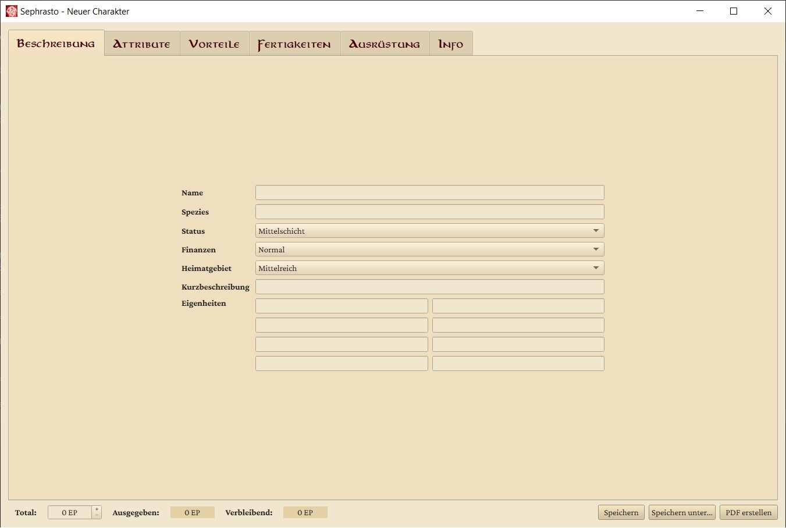
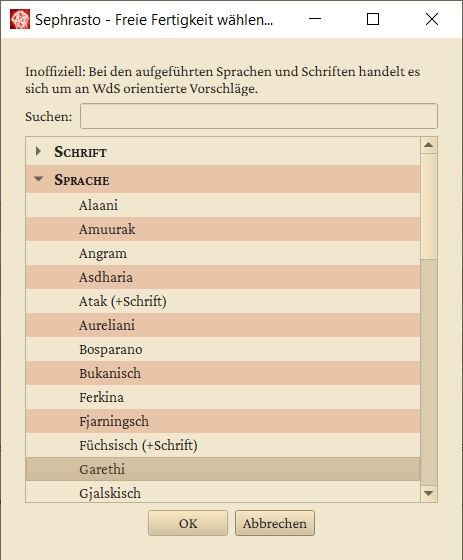
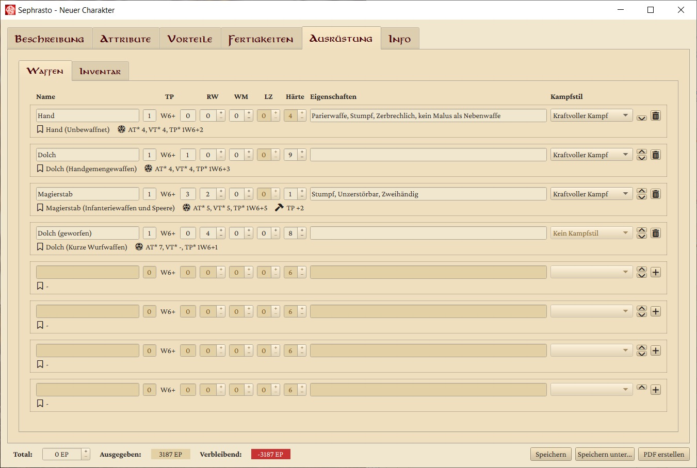
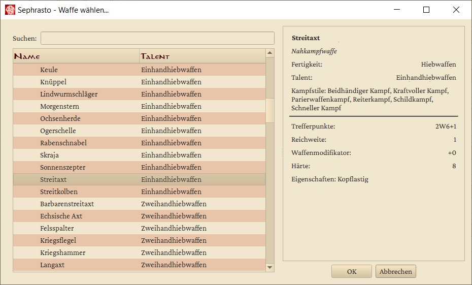
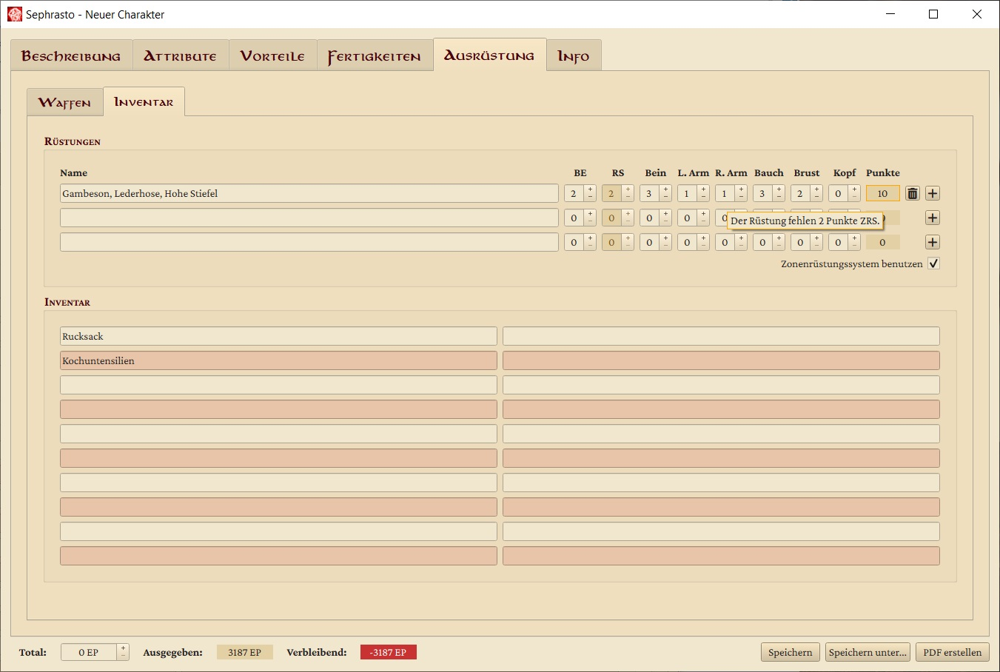

[Hilfe](Help.md) > Charaktereditor

# Charakter-Editor
Vom Startfenster aus gibt es zwei Möglichkeiten in den Charaktereditor zu gelangen: 

- Neuen Charakter erstellen: Mit einem Klick auf **Neuen Charakter erstellen** , öffnet sich ein neues Fenster mit dem Charaktereditor. Dieser besteht größtenteils aus einer Fläche mit verschiedenen Reitern, die Zugriff auf die unterschiedlichen Aspekte eines Charakters geben. Die einzelnen Reiter werden im Weiteren erläutert. Zusätzlich ist im unteren Teil des Fensters eine Steuerungsleiste zu sehen. Diese wird am Ende dieses Abschnitts erläutert.

- Vorhandenen Charakter bearbeiten: Wählst du diese Option, kannst du einen bereits abgespeicherten Charakter aus seiner XML-Datei einlesen. Sephrasto öffnet dann den oben erläuterten Charakter-Editor und befüllt automatisch alle Felder so, wie du sie ausgefüllt hattest. So kannst du Charaktere über viele Sitzungen hinweg in Sephrasto bearbeiten.
 
## Beschreibung
Die Beschreibung eines Charakters stellt das grundlegende Charakterkonzept dar. Für die allermeisten Charaktere wird sie ausgefüllt, bevor über irgendwelche Werte nachgedacht wird. Es handelt sich dabei um ausfüllbare Textfelder und Drop-Down-Menüs, deren Inhalt direkt auf den Charakterbogen übertragen wird. Die gewählten Finanzen beeinflussen dabei die eingetragenen SchiP\*, und die als Heimatgebiet gewählte Region macht das entsprechende Gebräuche-Talent kostenlos. Ansonsten haben die Eingaben in diesem Bereich innerhalb von Sephrasto keine weitere Wirkung.
  

 
## Attribute
Die Attribute deines Charakters bestimmen unter anderem, was für Vorteile er wählen kann. Du kannst in diesem Reiter die acht Attribute setzen, wobei du automatisch den entsprechenden Probenwert und die abgeleiteten Werte angezeigt bekommst. Die Boxen zum editieren des Attributswerts zeigen in einem Tooltip die Auswirkungen einer Steigerung an. Daneben findest du noch die Kosten für eine Steigerung um +1. Zusätzlich kannst du Astralenergie, Karmaenergie und Gunstpunkte dazukaufen, falls du über die entsprechenden Vorteile verfügst.
  

 
## Vorteile
In diesem Reiter kaufst du die Vorteile, über die dein Charakter verfügen soll. Er teilt sich in zwei Teile: Auf der linken Seite findest du eine tabellarische Aufführung aller für deinen Charakter verfügbaren Vorteile. Jeder Vorteil hat ein Kästchen neben seinem Namen, welches du auswählen kannst, um den Vorteil zu erwerben. Die Vorteile sind in verschiedene Kategorien aufgeteilt, die du aus- und einklappen kannst. Bei jedem Vorteil finden sich außerdem seine EP-Kosten. Für einige Vorteile ist dies ein ausfüllbares Feld: Dabei handelt es sich um Vorteile, die entweder mehrfach wählbar sind, oder die Kosten abhängig von ihrem Spielnutzen haben. Statt die Liste mit einer Vielzahl von Duplikaten zu verstopfen, kannst du so mit deinem Spielleiter absprechen, welche Kosten für deine Stärke des Vorteils angemessen sind. So würde man zum Beispiel für deinen Besonderen Besitz 'Schlachtross' Kosten von 40 EP ermitteln. Möchtest du zusätzlich ein verbessertes Enduriumschwert (120 EP), zahlst du eben insgesamt 160 EP für deinen Besonderen Besitz. In das Kommentarfeld trägst du dann deine konkrete Auswahl ein.
  

  
Auf der rechten Seite des Reiters findest du eine Beschreibung des aktuell ausgewählten Vorteils. Zuoberst sind Name, Kosten und Kategorie des Vorteils zu finden. Dazu findest du die Angaben dazu, wie häufig dieser Vorteil im späteren Spiel erworben wird. Schließlich findest du die komplette Beschreibung des Vorteils, so wie sie im Regelwerk steht. Hier stehen für Vorteile mit variablen Kosten oft auch Vorschläge, was für Kosten angebracht wären. 
Bei manchen Vorteilen werden unterhalb der Beschreibung außerdem noch **Querverweise** aufgeführt, bei denen du für den Vorteil relevante Regeln nachlesen kannst.
  
Erwirbst du den Vorteil **Minderpakt**, öffnet sich das ein weiteres Fenster, in welchem du den Vorteil wählen kannst, den du durch den **Minderpakt** erwerben möchtest.
  

  
Wähle einen Vorteil in der Liste aus und klicke auf **OK**. Klickst du stattdessen auf **Abbrechen** oder schließt du das Fenster, erhälst du keinen Vorteil.
 
Der durch **Minderpakt** gewählte Vorteil bleibt dir erhalten, auch wenn du seine Voraussetzungen nicht erfüllst. Verlernst du den Vorteil oder den Vorteil **Minderpakt** , so verlierst du auch die andere Hälfte. Handelt es sich bei dem Vorteil um einen Vorteil mit variablen Kosten, sind diese fest auf 20 EP gesetzt und lassen sich nicht verändern, solange der Vorteil durch deinen **Minderpakt** erworben ist.
 
Durch **Minderpakt** erworbene Vorteile sollten immer zuerst mit dem Meister abgesprochen werden. Vergiss nicht, dir auch die entsprechende Eigenheit hinzuzufügen!
 
## Fertigkeiten
In diesem Reiter kannst du die Fertigkeitswerte deines Charakters in den profanen Fertigkeiten setzen und Talente erwerben. Der Reiter teilt sich wieder in einen linken sowie einen rechten Teil.
  

  
Im linken Teil findest du die Liste der profanen Fertigkeiten, geordnet wie im Regelwerk. Um schnell und einfach deine Steigerungen durchführen zu können, kannst du hier auch direkt deinen Fertigkeitswert setzen, die Anzahl der gekauften Talente sehen und mit einem Mausklick neue Talente erwerben. Daneben findest du noch die Kosten für eine Steigerung um +1, den Probenwert ohne (PW) und mit Talent (PW(T)).
Auf der rechten Seite findest du wieder eine Detailansicht. Hier findest du den Steigerungsfaktor (SF) der Fertigkeit, die Attribute und den ausgerechneten Basiswert (BW), sowie erneut PW und PW(T). Auch hier kannst du den Fertigkeitswert einstellen. Außerdem gibt es eine Liste der bereits erworbenen Talente und ein Textfeld mit der Beschreibung der Fertigkeit aus dem Regelwerk.
 
Klickst du auf das Plus in der Tabelle oder über der Liste von Talenten, gelangst du in den Talentauswahlbildschirm. Hier findest du eine Liste aller für diese Fertigkeit verfügbaren Talente. Wieder kannst du durchs Anwählen der Kästchen neue Talente erwerben. Auch hier sind auf der rechten Seite des Fensters die Kosten des Talents sowie die Beschreibung aus dem Regelwerk zu finden. Falls der entsprechende Fertigkeitswert übrigens weniger als 4 beträgt, erscheint eine Warnung, da es sich üblicherweise dann noch nicht lohnt, EP in Talente zu investieren. 
  

  
Sephrasto sorgt dafür, dass Talente, die zu mehreren Fertigkeiten passen, auch bei allen auftauchen. Weiterhin sorgt das Tool dafür, dass du keine Fertigkeit über ihren Maximalwert hinaus steigerst. Erwirbst du das Gebräuche-Talent der Region, die du im Beschreibungs-Reiter als deine Heimatregion angegeben hast, stellt dir Sephrasto dafür übrigens keine EP in Rechnung!
 
## Freie Fertigkeiten
Hier kannst du all die Freien Fertigkeiten deines Charakters eintragen. Der erste Platz ganz oben links ist dabei für deine kostenlose Muttersprache reserviert – die du immer meisterlich beherrschst. Die anderen kannst du ganz nach Belieben füllen. Freigelassene Felder kosten dabei natürlich keine EP.
  

  
Der **+** -Knopf öffnet ein neues Fenster, in welchem du eine der in Regelbasis hinterlegten Freien Fertigkeiten auswählen kannst, um sie in die jeweilige Zeile einzutragen. In diesem Auswahlmenü findest du eine Liste aller DSA Sprachen und Schriften. Da das Ilaris-Regelwerk allerdings keine vollständige Liste definiert ist diese Liste inoffiziell. Die Sprachen Neckergesang, Drachisch und Koboldisch werden nur angezeigt, wenn der Charakter den Vorteil **Zauberer I** beherrscht.
  

 
## Übernatürliche Fertigkeiten
Dieser Reiter entspricht fast vollständig dem für Fertigkeiten. Allerdings findest du hier all die Fertigkeiten, welche dir nur mit den entsprechenden Vorteilen zur Verfügung stehen. Verfügst du nicht über die Vorteile **Zauberer I**, **Geweiht I** , oder **Paktierer I** und eine entsprechende Tradition, wird dir dieser Reiter nicht angezeigt. Wenn sich eine Fertigkeit nicht zu steigern lohnt, wird diese in der Liste unten einsortiert und mit einem Warnsymbol versehen - wenn du dir dazu den Tooltip anzeigen lässt, erfährst du den Grund.

Für Übernatürliche Fertigkeiten gibt es nur Spezialtalente. Da diese alle unterschiedliche Kosten haben, findest du hier in der Talentliste hinter dem Namen des Talents seine Kosten zur einfachen Übersicht.
  

  
Eine weitere Besonderheit ist, dass auch manche übernatürlichen Talente variable Kosten haben können. Dies ist z.B. beim **Adlerschwinge Wolfsgestalt** der Fall, wo über die Kosten die Anzahl und Gefährlichkeit der Tiere dargestellt wird. In diesem Fall kannst du in der Talentauswahl auf der rechten Seite die EP-Kosten frei einstellen und im Kommentarfeld das gewählte Tier bzw. die Tiere eintragen.
  

 
## Ausrüstung
Im Ausrüstungs-Reiter wählst du Waffen und Rüstung für deinen Charakter. Diese kosten keine EP und haben somit keinen Einfluss auf die anderen Bereiche der Charaktererstellung.
 
### Waffen

  
Du kannst du bis zu acht Waffen eingeben, die auf den Charakterbogen sollen.
- Klicke in einer beliebigen Zeile auf den **+** -Knopf, um eine Waffe auszuwählen (siehe unten).
- Im ersten Textfeld kannst du den **Namen** der Waffe eintragen.
- Die Trefferpunkte ( **TP** ) teilen sich auf in Würfelanzahl und Zusatzschaden.
- Die Reichweite ( **RW** ), der Waffenmodifikator ( **WM** ) bzw. die Ladezeit ( **LZ** ) und die **Härte** der Waffe werden so direkt auf den Charakterbogen übertragen.
- Im zweiten Textfeld kannst du die **Waffeneigenschaften** eintragen. Wenn du dir den Tooltip zu diesem Feld anzeigen lässt erhältst du den Regeltext zu allen Eigenschaften.
- Das Dropdown-Menü zum **Kampfstil** bietet dir alle Kampfstile an, für die du den entsprechenden Vorteil erworben hast und welche mit der Waffe verwendbar sind.
- Unterhalb des Waffennamens siehst du die **Basiswaffe**, auf deren Werten deine Waffe basiert. Hierüber bezieht Sephrasto beispielsweise die Information, ob es eine Nah- oder Fernkampfwaffe ist, unter welchem Talent sie geführt wird und welche Kampfstile verfügbar sind. Daneben siehst du die endgültigen AT\*, VT\* und TP\*, wie sie im Charakterbogen erscheinen werden. Hier werden Probenwert, Schadensbonus (inkl. Kopflastig), der gewählte Kampfstil und die BE zusammengerechnet. Falls du die Waffe außerdem z. B. durch Handwerk verbessert hast, erscheinen an dritter Stelle die vorgenommenen Modifikationen, relativ zur Basiswaffe.
 
### Waffenauswahl

  
Der **+** -Knopf bei den Waffen öffnet ein neues Fenster, in welchem du eine der in Regelbasis hinterlegten Waffen auswählen kannst, um sie in die aktuelle Zeile einzutragen. In diesem Waffenauswahlmenü findest du eine vollständige Liste aller im Regelwerk aufgeführten Waffen. Diese sind nach der Fertigkeit und nach dem entsprechenden Talent sortiert. Waffen, welche mit mehreren Fertigkeiten geführt werden können, werden mehrfach aufgeführt.
  
Auf der rechten Seite finden sich alle Informationen über die Waffe, inklusive der verfügbaren Kampfstile. Mit einem Klick auf **OK** wird die aktuell ausgewählte Waffe in den Ausrüstungs-Reiter übertragen.
  
Wenn du **Hand** oder **Fuß** auswählst, wird als Härte übrigens automatisch die WS\* deines Charakters eingetragen!
 
### Inventar

  
Im oberen Bereich des Reiters kannst du bis zu drei Rüstungen eingeben, die du später auf dem Charakterbogen wiederfinden wirst. Wichtig ist hierbei, dass die für die oberste Rüstung eingetragene Behinderung (BE) und Rüstungsschutz (RS) auch die sind, auf deren Basis auf dem Charakter WS\* und DH\* sowie deine Kampfwerte berechnet werden. Es sollte also deine üblicherweise getragene Rüstung sein!
  
Die Auswahlbox in der unteren rechten Ecke des Rüstungsteils ermöglicht es dir, vom Zonenrüstungssystem ins einfache System mit nur BE und RS zu wechseln, wenn ihr ohne Trefferzonen spielt. Im Zonensystem wirst du gewarnt, wenn der ZRS-Gesamtwert kein Vielfaches von 6 ist - hier musst du gegebenenfalls nachjustieren.
  
Der **+** -Knopf bei den Rüstungen öffnet ein neues Fenster, in welchem du eine der in Regelbasis hinterlegten Rüstungen auswählen kannst, um sie in die aktuelle Zeile einzutragen. In diesem Rüstungsauswahlmenü findest du eine vollständige Liste aller im Regelwerk aufgeführten Rüstungen. Diese sind nach Rüstungstyp sortiert.
  
Unterhalb der Rüstungen stehen dir 20 Textfelder zur Verfügung, in die du Gegenstände eintragen kannst. Sie haben innerhalb von Sephrasto keinen Einfluss, aber werden ebenfalls mit auf den Charakterbogen übertragen.
 
### Rüstungsauswahl

  
Auf der rechten Seite finden sich alle Informationen über die Rüstung. Mit einem Klick auf **OK** wird die aktuell ausgewählte Rüstung in den Ausrüstungs-Reiter übertragen. Wenn die Rüstungszeile bereits eine Rüstung enthält, wird die selektierte Rüstung der existierenden hinzugefügt, RS- und BE- Werte werden addiert. Dies kannst du nutzen um mehrere Rüstungslagen zu kombinieren oder Zusatzrüstungen wie z.B. Lederzeug hinzuzufügen. Falls du das nicht möchtest, dass Rüstungen kombiniert werden, kannst du im Auswahlmenu auf _Rüstung ersetzen_ klicken. 
**Wichtig:** Die aufgelisteten Rüstungen sind nur Beispiele, der Spielleiter hat das letzte Wort.
 
## Info
Auf der linken Seite kannst du Notizen eintragen. Normalerweise erscheinen sie nicht auf dem Charakterbogen - eine Ausnahme ist der NSC-Charakterbogen, der die Notizen auf der Meisterinfo-Seite ausgibt. Auf der rechten Seite findest du sowohl Einstellungsmöglichkeiten für deinen Charakter, als auch Informationen zur EP-Verteilung.
  

  
Einstellungsmöglichkeiten:
- Voraussetzungen überprüfen: Wählst du den Haken ab, prüft Sephrasto nicht mehr automatisch, ob du die Voraussetzungen für deine Vorteile, Talente und Fertigkeiten erfüllst. Das kann praktisch sein, wenn du dir nur einen Überblick verschaffen möchtest, oder wenn du einen nicht regelkonformen Charakter erstellen willst, der zum Beispiel über einen Pakt an sonst nicht verfügbare Vorteile gekommen ist. Aber Achtung! Wählst du das Kästchen wieder an, werden die Voraussetzungen geprüft und alle so ausgewählten Vorteile, Fertigkeiten und Talente werden wieder entfernt.
- Vor dem ersten Abenteuer: Nach dem ersten Abenteuer kannst du den Haken abwählen. Es werden dann die nicht mehr relevanten Finanzen ausgeblendet und die aktuellen Schicksalspunkte werden nicht mehr ausgegeben, da diese dann händisch verwaltet werden.
- Hausregeln: Hier kannst du auswählen, ob und welche Hausregeldatei verwendet werden soll. Nach einer Änderung musst du den Charakter neu laden (unbedingt eine Sicherheitskopie erstellen!).
- Charakterbogen: Für die meisten Spieler ist der Standard-Charakterbogen ausreichend. Falls du aber mehr als 2 Fertigkeiten hinzufügen möchtest, solltest du den langen Bogen verwenden. Er benötigt eine zusätzliche Seite, bietet aber neben der Möglichkeit ein Bild, das Aussehen und den Hintergrund des Charakters einzutragen, zusätzliche Felder für Freie Fertigkeiten und profane Fertigkeiten - damit ist er interessant für Gruppen mit größeren Hausregelsammlungen. Der kurze Charakterbogen benötigt nur eine A5 Seite und ist insbesondere für Begleiter interessant. Der NSC Charakterbogen bietet sich für Spielleiter an. **Hinweis**: Falls du einen der anderen Charakterbögen wählst, erscheint nach erneutem Laden des Charakters ein Details-Reiter unter dem Beschreibungs-Reiter. Dort kannst du zusätzlichen Felder ausfüllen und ein Charakterbild laden.
- Relevante Regeln anhängen: Neben allgemeinen Regeln u.a. zu Rededuellen und Kampfaktionen werden dir die Regeln zu allen dem Charakter verfügbaren Vorteilen, Waffeneigenschaften, spontanen Modifikationen und übernatürlichen Talenten ausgegeben. In der Regelkategorien-Liste kannst du einzelne dieser Bereiche deaktivieren.
- Formularfelder editierbar: Wenn du den Haken entfernst, wird der resultierende Charakterbogen keine Formularfelder mehr haben. Dies sorgt für etwas kleinere Dateigrößen. Hauptsächlich ist es aber für Nutzer von Non-Mainstream PDF-Readern gedacht, die mit Formularfeldern Probleme haben können.
- PDF-Ausgabe von übernatürlichen Fertigkeiten manuell auswählen: Sephrasto gibt standardmäßig nur übernatürliche Fertigkeiten aus, die einen FW > 0 haben und für die mindestens ein Talent erworben wurde. Setze hier einen Haken, wenn du lieber selbst einstellen möchtest, welche ausgegeben werden. Dadurch erscheint im Übernatürliches-Reiter eine PDF-Spalte
 
## Die Fußzeile
In der Fußzeile, die in allen Reitern verfügbar ist, findest du die grundlegendsten Parameter deiner Charaktererstellung.
  
Zunächst findest du einen Zähler, an dem du die Menge an EP einstellen kannst, über welche dein Charakter verfügt. Sephrasto berechnet stets automatisch die EP-Kosten des Charakters, welchen du gerade erstellst, und passt die Werte für die Ausgegebenen und Verbleibenden EP entsprechend an. Hast du mehr EP ausgegeben, als du zur Verfügung hast, ist der Zähler für die verbleibenden EP rot hinterlegt.
  
Schließlich findest du in der unteren rechten Ecke drei Knöpfe. Klickst du auf **Speichern/Speichern unter**, hast du die Möglichkeit, den aktuellen Charakter als XML-Datei auf deinem Computer abzuspeichern und später weiterzumachen.
  
Wenn du auf **PDF erstellen** klickst, kannst du einen Speicherort und Namen wählen. Sephrasto erstellt dann für dich einen Charakterbogen, der alle Werte beinhaltet, welche du eingetragen hast. 
Dabei befüllt Sephrasto die Felder sinnvoll sortiert. So werden profane Vorteile auf der ersten Seite, Kampfvorteile auf der Zweiten und Übernatürliche Vorteile auf der dritten Seite eingetragen. Ist dafür nicht genug Platz, werden die übrigen Vorteile in den vorhanden Feldern kombiniert. Wenn auch damit der Platz ausgeht, werden Vorteile in freie Felder auf den anderen Blättern eingetragen. Ist für eine profane Fertigkeit kein Platz mehr, lässt Sephrasto sie weg.
 
## Sonderfälle
In seltenen Fällen geht Sephrasto einen Sonderweg. Diese sind hier beschrieben:
- Die große Tiertabelle, die für Blutgeister, Tiergeister und Schutzgeister verwendet wird, wurde in Sephrasto in Form von kostenlosen Vorteilen integriert. Diese schalten entsprechende Zauber frei und geben im Regelanhang die Werte des gewählten Tieres mit aus.
- Die Zauber Brenne toter Stoff, Hartes Schmelze und Weiches Erstarre stehen Gildenmagiern, Scharlatanen und Geoden nicht unter Dämonisch zur Verfügung. Zur Umsetzung dieser Vorgabe wurden die Zauber dupliziert - eine Variante mit Zugriff auf alle Fertigkeiten und eine ohne Dämonisch. Die genannten Traditionen sehen nur die Variante ohne Dämonisch. Falls aber eine Zweittradition gekauft wird, die Zugriff auf die andere Variante hat, werden beide sichtbar. In diesem Fall sollte die Variante ohne Dämonisch abgewählt und die mit Dämonisch ausgewählt werden.